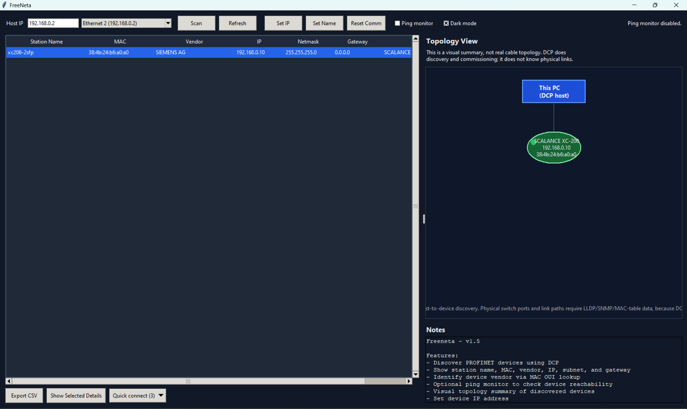

# FreeNeta

Lightweight **PROFINET discovery and commissioning tool** written in Python.

FreeNeta allows you to quickly discover and configure PROFINET devices using **DCP** without needing heavyweight vendor tools.

The project started because downloading Siemens **PRONETA** requires creating an account and registering personal details just to access a "free" tool. FreeNeta aims to provide a **simple, lightweight, open-source alternative** for basic discovery and diagnostics.

---

## Features

- Discover PROFINET devices via **DCP**
- View **station name, MAC, vendor, IP, subnet, gateway**
- **Vendor lookup** via MAC OUI
- **Ping monitoring** for device reachability
- Set **device IP address**
- Set **station name**
- Reset **communication parameters**
- **Quick connect** actions (HTTP / HTTPS / SSH)
- **Visual topology overview** of discovered devices

---

## Screenshot

